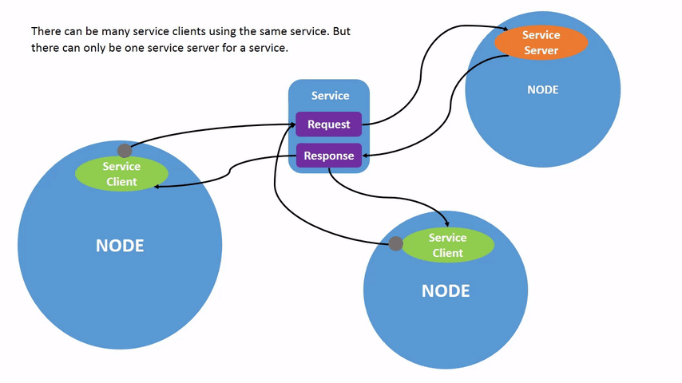

- [Introduction to ROS2](#introduction-to-ros2)
  - [Course Structure :space\_invader:](#course-structure-space_invader)
  - [lesson 1](#lesson-1)
    - [Colcon](#colcon)
    - [Duplex](#duplex)
    - [Simplex](#simplex)
  - [lesson 2](#lesson-2)
    - [`rclcpp` ROS Client Library for C++ ROS](#rclcpp-ros-client-library-for-c-ros)
    - [What is ROS and Why ROS](#what-is-ros-and-why-ros)
    - [ROS Philosophy](#ros-philosophy)
    - [ROS in the example of Spot](#ros-in-the-example-of-spot)
    - [ROS Structure](#ros-structure)
    - [ROS File System](#ros-file-system)
    - [ROS vs ROS2](#ros-vs-ros2)
  - [lesson 3 ros basics (CRUD)](#lesson-3-ros-basics-crud)
    - [**callback function**](#callback-function)
    - [**std::bind**](#stdbind)
    - [**`rclcpp::init(argc, char **argv)`**](#rclcppinitargc-char-argv)
    - [**`rclcpp::spin(node)`**](#rclcppspinnode)
    - [**`rclcpp::Executor`**](#rclcppexecutor)
    - [**`rclcpp::shutdown()`**](#rclcppshutdown)
    - [**Creating/Running packages**:](#creatingrunning-packages)
  - [interfaces](#interfaces)
  - [Docker](#docker)
    - [Why Docker instead of usual installation?](#why-docker-instead-of-usual-installation)
    - [Creating docker container](#creating-docker-container)
    - [Usefull commands](#usefull-commands)
  - [Git/Github](#gitgithub)
    - [Forking](#forking)
    - [Getting changes to forked repo from original repo](#getting-changes-to-forked-repo-from-original-repo)
  - [Bash](#bash)
    - [tmux](#tmux)
    - [Nano](#nano)
    - [Extra](#extra)
  - [**process, thread, multiprocessing, multithreading, parallel programming, concurrency, task**](#process-thread-multiprocessing-multithreading-parallel-programming-concurrency-task)
  - [Round-robin scheduling](#round-robin-scheduling)


# Introduction to ROS2
## Course Structure :space_invader:
    
- Section 1 :alien:	
    - ROS2 Fundamentals [:books: lec01 ](lectures/ros2_fundamentals.pdf) [:books: lec02 ](lectures/ros2_fundamentals_2.pdf) [:scroll: code](hello_world/src/)
    - Workout Examples  [:books:](lectures/recap.pdf) [:scroll: code]()
- Section 2 :alien:	
    - ROS2 Visualization  [:books:](lectures/ros2_visualization.pdf) [:scroll: code](ros2_visualize/)
    - ROS2 Debugging [:books:](lectures/ros2_debugging_and_logging.pdf) [:scroll: code](ros2_debug_logging/)	
    - ROS2 Basic Control [:scroll: code](ros2_visualize/src/joy_hagen_basic_control_todo.cpp)	
    - ROS2 Simulation (Gazebo+SDF) [:books:](lectures/ros2_gazebo_sdf.pdf) [:scroll: code](hagen_robot/hagen_robot_diff_drive/hagen_robot_diff_drive/)	
    - ROS2 Control robot [:scroll: code](hagen_robot/hagen_robot_controller/)	
- Section 3 :alien:	
    - Mini Group Project 
- References
    - https://docs.ros.org/en/humble/index.html


## lesson 1
### Colcon
So in simple terms, colcon:

  1. Finds all ROS packages in a workspace
  2. Uses cmake to build each package
  3. Installs the packages
  4. Generates a setup.bash file for the workspace
  ```bash
      colcon build         # Build all packages in a workspace
      colcon build --packages-select <pkg1> <pkg2>    # Build only specified packages
      colcon build --symlink-install  # Install packages by symlinking them (for development)
      source install/setup.bash     # Add the workspace to your environment (after building)
      colcon list         # List all packages in a workspace
      colcon graph        # Show the dependency graph between packages
  ```
### Duplex
* communication refers to a mode of communication where two devices can both transmit and receive data simultaneously.

### Simplex
* is a mode of communication where data is transmitted in one direction only. In other words, one device can only transmit data, while the other device can only receive data. 


## lesson 2

### `rclcpp` ROS Client Library for C++ ROS
-  is a C++ library that provides the necessary functionality for creating and managing ROS nodes, as well as publishing and subscribing to topics, managing parameters, and executing actions. It is a fundamental part of the ROS2 framework, enabling C++ developers to build robotic applications.
- Key features:
  1. Node abstraction: `rclcpp::Node`
  2. Publisher and Subscriber: `rclcpp::Publisher` and `rclcpp::Subscriber` classes are used for publishing and subscribing to messages on ROS 2 topics. They provide a convenient interface for sending and receiving data between different nodes.
  3. Service and Client: `rclcpp::Service` and `rclcpp::Client` classes are used for implementing and calling ROS 2 services, respectively. They enable request-response communication patterns between nodes.
  4. Parameter management: `rclcpp::Parameter` and `rclcpp::ParameterServer` provide functionality for managing and accessing parameters within a ROS 2 system. Parameters allow dynamic configuration of nodes and can be modified at runtime.
  5. Timer and Callbacks: `rclcpp::Timer` class allows you to schedule periodic callbacks, while `rclcpp::CallbackGroup` provides a mechanism for managing multiple callbacks associated with a node.
  6. Lifecycle management: `rclcpp_lifecycle` package extends rclcpp to support node lifecycle management, allowing nodes to transition between different states (e.g., configuring, activating, deactivating, cleaning up).


<div style="text-align: center;">
  
</div>

The *Robot Operating System* a.k.a __ROS__ is an operating system for robots. Similar to the operating systems of PCs, servers, or stand-alone devices.

It provides services similar to an operating system (hardware abstraction, management of concurrency, processes, etc.) but also high-level functionalities (asynchronous calls, synchronous calls, centralized database of data, configuration system robot …) [[1]](https://just-merwan.medium.com/all-you-need-to-know-to-get-started-with-ros-the-robot-operating-system-a811ed6b9014).

### What is ROS and Why ROS
- **ROS**, the Robot Operating System, is a powerful framework used for developing and controlling robots. It provides a collection of software libraries, tools, and conventions that help engineers and researchers build advanced robotic systems. Let's explore why we need **ROS** with some examples:

  - **Modularity and Reusability**: **ROS** promotes a modular approach to robotics development. It allows us to break down complex robot systems into smaller, reusable components called nodes. For example, we can have separate nodes for controlling the robot's movement, processing sensor data, and performing high-level decision-making. These nodes can be developed and tested independently, making it easier to reuse and share code across different robots or projects.

  - **Communication and Message Passing**: **ROS** enables seamless communication between different parts of a robot system. Nodes can send messages to each other, sharing information such as sensor readings, commands, or even images. For instance, a camera node can publish images, and another node responsible for image processing can subscribe to those images to detect objects. This communication facilitates coordination and collaboration between robot components.

  - **Visualization and Debugging**: **ROS** provides tools for visualizing and debugging robot systems. One such tool is RViz, which allows us to visualize sensor data, robot models, and trajectories in a 3D environment. For example, we can use RViz to visualize the laser scan data from a robot's range sensor or to debug the path planning algorithm by visualizing the planned trajectory.

  - **Simulation and Testing**: **ROS** offers simulation capabilities through tools like Gazebo. Simulation allows us to test and validate robot behavior in a virtual environment before deploying it on real hardware. For example, we can simulate a drone's flight dynamics and control algorithms in Gazebo to evaluate its performance or test different navigation strategies without the risk of damaging physical equipment.

  - **Community and Collaboration**: **ROS** has a large and active community of researchers, developers, and robotics enthusiasts. This community contributes to the development of **ROS** by sharing code, creating packages, and providing support. For example, numerous open-source packages exist for various robotic tasks, such as mapping, perception, and manipulation. These packages can be leveraged to jumpstart robot development and accelerate progress.

  - **Robotics Education and Research**: **ROS** serves as an excellent platform for learning and teaching robotics. Its ease of use, extensive documentation, and abundant learning resources make it accessible for educational institutions and students to understand and experiment with robotic concepts. Moreover, researchers can use **ROS** to prototype new algorithms, conduct experiments, and validate their findings in a standardized and reproducible manner.

  - In summary, **ROS** provides a modular and flexible framework that facilitates communication, visualization, simulation, and collaboration in robotics. It promotes code reuse, simplifies debugging, and accelerates development. With **ROS**, engineers and researchers can focus on building innovative robot applications by leveraging the capabilities of a thriving community and a rich ecosystem of packages and tools.


<div style="text-align: center;">
  
</div>

- Before the advent of ROS (Robot Operating System), the development of robots was often fragmented and lacked a standardized framework. Let's explore some of the problems that existed before ROS and how ROS addressed them:

  - Lack of Standardization:
    - Before ROS: Robotics development involved reinventing the wheel for each project, as there was no standardized framework for building robot software. Each project had to develop its own communication protocols, driver interfaces, and tools, leading to significant duplication of effort.
    - With ROS: ROS provided a standardized and modular framework for building robot software. It introduced a common communication architecture, message passing, and package management system. This allowed developers to leverage existing libraries and tools, saving time and effort. For example, instead of writing custom code for communication between modules, developers can use ROS's messaging system to easily exchange data between different components of a robot.

  - Limited Code Reusability:
    - Before ROS: Reusing code across different robot projects was challenging due to the lack of a shared framework. Developers often had to start from scratch or adapt code from previous projects, leading to inefficiencies and reduced productivity.
    - With ROS: ROS introduced a package-based architecture that promotes code reuse. Developers can create and share packages that encapsulate functionality for specific tasks or components. For instance, packages for perception, motion planning, or control can be reused across different robots, saving development time and fostering collaboration within the robotics community.

  - Communication and Integration Challenges:
    - Before ROS: Integrating hardware components, such as sensors and actuators, with software was a complex and time-consuming task. Developing custom drivers and managing communication between different components required significant effort.
    - With ROS: ROS provided a communication infrastructure that simplifies the integration of hardware and software components. It offers standardized interfaces and protocols for connecting sensors, actuators, and other robot modules. For example, developers can utilize existing ROS drivers for popular sensors like cameras or LIDARs, allowing easier integration with the robot's perception system.

  - Limited Tools for Visualization and Debugging:
    - Before ROS: Visualizing and debugging robot behavior, sensor data, and internal states were challenging due to the lack of standardized tools. Developers often had to build custom visualization and debugging tools for each project.
    - With ROS: ROS introduced powerful visualization and debugging tools like RViz and RQT, which provide real-time visualizations of robot states, sensor data, and message passing. These tools make it easier to understand and debug complex robot behaviors, aiding in the development and testing process.

  - Community Collaboration:
    - Before ROS: Collaboration and knowledge sharing among robotics researchers and developers were limited. There was no centralized platform for sharing code, algorithms, or best practices.
    - With ROS: ROS created a vibrant community and an ecosystem for collaboration. Developers can share their work through ROS packages, participate in forums, and contribute to open-source projects. This collaboration accelerates the development of robotics technologies and promotes the exchange of ideas and solutions.

- Overall, ROS addressed the challenges of standardization, code reusability, communication, visualization, and community collaboration in robotics development. It provided a common framework and tools, enabling developers to focus on higher-level tasks rather than reinventing basic functionalities. ROS fostered a collaborative environment where developers can build upon each other's work, accelerating the progress and adoption of robotics technology.

### ROS Philosophy
<div style="text-align: center;">
  
</div>

1. **Modularity**: ROS promotes a modular approach to building robot systems. It encourages breaking down complex tasks into smaller, manageable components that can communicate with each other. This modular design enables code reuse and facilitates collaboration within the robotics community. For example, in a robot with perception, planning, and control modules, ROS allows each module to be developed and tested independently, ensuring flexibility and maintainability.

2. **Peer-to-Peer Communication**: ROS emphasizes peer-to-peer communication between modules, enabling them to exchange data and messages seamlessly. This communication is based on a publish-subscribe model, where nodes can publish information (e.g., sensor data) and subscribe to relevant data streams from other nodes. For instance, in a self-driving car, the perception module can publish information about detected objects, which the planning module can subscribe to in order to make informed decisions.

3. **Tools and Libraries**: ROS provides a rich set of tools and libraries to support robotics development. These tools simplify tasks such as visualizing robot states, debugging code, and managing software dependencies. For example, RViz allows developers to visualize the robot's environment and monitor its sensor data in real-time, aiding in the development and testing process.

4. **Code Reusability**: ROS encourages the development and sharing of reusable software components. Developers can create packages that encapsulate specific functionalities, such as mapping, localization, or control algorithms. These packages can be easily integrated into different robot projects, saving time and effort. For instance, a package developed for object recognition can be reused in various robots with different sensors and hardware configurations.

5. **Community Collaboration**: ROS fosters a collaborative environment where developers and researchers can share knowledge, code, and best practices. The ROS community actively contributes to the development of new packages, tools, and algorithms, making them available to the wider community. This collaboration accelerates the advancement of robotics technology and encourages learning and innovation.

### ROS in the example of Spot

<div style="text-align: center;">
  
</div>

- **Hardware Integration**:
  - Spot has various hardware components such as cameras, **LIDARs**, and motor controllers. ROS2 allows seamless integration of these components through the use of ROS2 packages and drivers. For example, ROS2 provides packages like `ros2_camera` to interface with Spot's cameras and `ros2_lidar` to handle **LIDAR** data.

- **Perception and Mapping**:
  - Spot relies on perception to understand its surroundings. ROS2 offers perception libraries and algorithms that can be utilized. For instance, Spot can utilize the `ros2_pointcloud_library` (PCL) to process point cloud data from its **LIDAR** sensor and create a 3D map of the environment. This enables Spot to navigate and make informed decisions based on its perception of the surroundings.

- **Motion Control**:
  - ROS2 facilitates motion control for Spot. For instance, ROS2's `ros2_control` package provides a framework for defining and controlling robot joints and actuators. This allows developers to implement controllers for Spot's legs and body, enabling precise and coordinated movements.

- **Behavior and Decision-Making**:
  - ROS2 enables the development of high-level behaviors and decision-making processes for Spot. Developers can use ROS2's *computational graph-based architecture* to create behavior trees or state machines. For example, Spot can have behaviors like *"walk forward"*, *"turn left"*, or *"stop and sit"*. These behaviors can be implemented using ROS2's message passing and node communication capabilities.

- Communication and Coordination:
  - ROS2's communication infrastructure enables seamless communication and coordination between Spot's software components. For example, Spot's perception module can publish sensor data like camera images and **LIDAR** scans using ROS2 messages. The control module can subscribe to these messages to make decisions and send commands to the motion control module, allowing coordinated movement based on perception.

- Simulation and Testing:
  - ROS2 supports simulation environments like **Gazebo**, which can be used to simulate Spot's behavior and test different control algorithms or scenarios. Developers can create a virtual representation of Spot in **Gazebo** and validate its performance before deploying the code on the actual hardware. This helps identify and fix issues early in the development process.

- Monitoring and Debugging:
  - ROS2 provides tools for monitoring and debugging Spot's behavior in real-time. Developers can use tools like **RViz** to visualize Spot's sensor data, such as camera images or **LIDAR** scans. They can also use the `rqt` toolset to monitor node activity, inspect message data, and debug issues. These tools aid in identifying and resolving any problems during development.

- By utilizing the capabilities of ROS2, developers can build a sophisticated robot like Spot with modular and interconnected software components. ROS2's extensive package ecosystem, communication infrastructure, simulation support, and debugging tools make it a powerful framework for building and controlling robots like Spot.


### ROS Structure
<div style="text-align: center;">
  
</div>

- **Nodes**: Nodes in ROS 2 are similar to nodes in ROS 1. They represent individual software modules that perform specific tasks or computations e.g. controlling the wheel motors or publishing the sensor data from a laser range-finder. Each node can send and receive data from other nodes via topics, services, actions, or parameters. For example, you can have nodes for perception, planning, control, and communication in a robot system. Each node operates independently and can communicate with other nodes.
  <div style="text-align: center;">
  
  </div>
- A full robotic system is comprised of many nodes working in concert. In ROS 2, a single executable (C++ program, Python program, etc.) can contain one or more nodes.
- [more about nodes](https://docs.ros.org/en/foxy/Tutorials/Beginner-CLI-Tools/Understanding-ROS2-Nodes/Understanding-ROS2-Nodes.html)

- **Topics and Publishers/Subscribers**: ROS 2 retains the concept of topics for communication between nodes, but introduces a more flexible and efficient messaging system. ROS 2 breaks complex systems down into many modular nodes. Topics are a vital element of the ROS graph that act as a bus for nodes to exchange messages. Publishers are nodes that publish messages on a specific topic, and subscribers are nodes that receive and process those messages. For example, a camera node can publish images on a "camera" topic, and the perception module can subscribe to that topic to process the camera data. A node may publish data to any number of topics and simultaneously have subscriptions to any number of topics. Topics are one of the main ways in which data is moved between nodes and therefore between different parts of the system.
  <div style="text-align: center;">
  
  </div>
- [more about topics](https://docs.ros.org/en/rolling/Tutorials/Beginner-CLI-Tools/Understanding-ROS2-Topics/Understanding-ROS2-Topics.html)

- **Services and Clients/Servers**: Services are another method of communication for nodes in the ROS graph. Services are based on a call-and-response model versus the publisher-subscriber model of topics. While topics allow nodes to subscribe to data streams and get continual updates, services only provide data when they are specifically called by a client. Similar to ROS 1, ROS 2 supports services for requesting and receiving specific computations or tasks. Clients send service requests to servers, which then provide the requested functionality and send back a response. For example, a *control node* can send a service request to a *planning node*, asking for a path plan, and receive a planned trajectory as a response.
  <div style="text-align: center;">
  
  </div>

- **Actions**: ROS 2 introduces the concept of actions, which allow for more complex and long-running behaviors compared to services. Actions provide a way for clients to send a request to a server and receive periodic feedback until the request is completed. For instance, a robot's *navigation module* can use an action to request a move to a specific location while receiving progress updates.
- Actions are one of the communication types in ROS 2 and are intended for long running tasks. They consist of three parts: a `goal`, `feedback`, and a `result`.
- Actions are built on topics and services. Their functionality is similar to services, except actions can be canceled. They also provide steady feedback, as opposed to services which return a single response.
- Actions use a client-server model, similar to the publisher-subscriber model (described in the topics tutorial). An “action client” node sends a goal to an “action server” node that acknowledges the goal and returns a stream of feedback and a result.
  <div style="text-align: center;">
  
  </div>
- [more about actions](https://docs.ros.org/en/rolling/Tutorials/Beginner-CLI-Tools/Understanding-ROS2-Actions/Understanding-ROS2-Actions.html)

- **Parameters**: ROS 2 includes a parameter system similar to ROS 1. Parameters are used to store and share configuration settings across nodes. They allow dynamic changes to node behavior without modifying the source code. For example, parameters can be used to set the maximum speed of a robot's motors or adjust the sensitivity of a sensor.
- You can think of parameters as node settings. A node can store parameters as integers, floats, booleans, strings, and lists. In ROS 2, each node maintains its own parameters. For more background on parameters, please see the [concept document](https://docs.ros.org/en/rolling/Concepts/About-ROS-2-Parameters.html).
- [more about parameters](https://docs.ros.org/en/rolling/Tutorials/Beginner-CLI-Tools/Understanding-ROS2-Parameters/Understanding-ROS2-Parameters.html)

- **Launch Files**: Similar to ROS 1, ROS 2 also uses launch files to start and configure multiple nodes together. Launch files specify which nodes to run, their parameters, and connections between topics, services, and actions. Launch files simplify the deployment and configuration of complex robot systems.
- In most of the introductory tutorials, you have been opening new terminals for every new node you run. As you create more complex systems with more and more nodes running simultaneously, opening terminals and reentering configuration details becomes tedious.
- Launch files allow you to start up and configure a number of executables containing ROS 2 nodes simultaneously.
- Running a single launch file with the `ros2 launch` command will start up your entire system - all nodes and their configurations - at once.
  <div style="text-align: center;">
  
  </div>
- [more about launch files](https://docs.ros.org/en/rolling/Tutorials/Beginner-CLI-Tools/Launching-Multiple-Nodes/Launching-Multiple-Nodes.html)

- **Data Distribution Service (DDS)**: ROS 2 utilizes the DDS communication middleware, which provides efficient and scalable data exchange between nodes. DDS ensures real-time communication, reliable message delivery, and robustness in large-scale systems. It enables nodes to communicate directly with each other, eliminating the need for a central master node.
  <div style="text-align: center;">
  
  </div>
- In simple words, the Data Distribution Service (DDS) is a communication middleware that allows different parts of a system to exchange data with each other reliably and efficiently.

  - Imagine you have a group of friends sitting around a table, and they need to share information with each other. Instead of one person speaking at a time and everyone listening, DDS enables everyone to talk directly to each other simultaneously.

  - In the context of robotics or distributed systems, DDS serves as a communication backbone. It provides a way for different components or nodes (such as sensors, controllers, or actuators) to communicate directly with each other without relying on a central coordinator.

  - DDS ensures that messages are delivered reliably and in real-time, meaning they arrive at their intended destination without being lost or delayed. It handles the complexities of communication, such as managing network connections, routing messages, and resolving conflicts. This allows the components of a system to collaborate seamlessly and efficiently.

  - Think of DDS as a sophisticated messaging system that enables efficient and reliable communication between various parts of a system, making it possible for them to work together effectively. It enhances the overall performance, scalability, and responsiveness of distributed applications, including complex robotics systems.
- Imagine you have a robot called Spot that needs to perform various tasks, such as navigating, sensing its environment, and interacting with humans. To accomplish these tasks, Spot relies on different components, such as cameras, sensors, controllers, and decision-making modules. Now, let's see how DDS comes into play:
  - **Efficient and Direct Communication**: DDS enables efficient and direct communication between the components of Spot. For instance, Spot's camera can send images directly to the perception module, the sensors can provide data directly to the control module, and the decision-making module can send commands directly to the actuators. This direct communication allows Spot's components to exchange information quickly and without unnecessary delays.
  - **Reliable Message Delivery**: DDS ensures that messages exchanged between Spot's components are reliably delivered. If the perception module sends a message containing information about detected objects, DDS guarantees that this message reaches the decision-making module without being lost or corrupted. This reliability is crucial for Spot to make accurate decisions based on up-to-date information.
  - **Real-time Communication**: DDS supports real-time communication, meaning that Spot's components can exchange information with low latency. For example, if Spot's control module needs to send commands to the actuators for immediate action, DDS ensures that these commands reach the actuators in a timely manner, enabling Spot to respond quickly to changes in its environment.
  - **Scalability and Flexibility**: DDS is designed to handle large-scale systems, allowing Spot to scale its capabilities as needed. As Spot's functionality grows or additional components are added, DDS can handle the increased communication load without compromising performance. This scalability and flexibility are essential for Spot to adapt to different environments and perform complex tasks.
- **Composition**: in ROS 2 refers to the ability to build complex robot systems by combining multiple smaller components or nodes together. Think of it as assembling a robot system from different building blocks, where each block represents a specific functionality or task.
  - Here's an example to illustrate composition in ROS 2:
  - Imagine you're building a robotic system that includes a mobile base, an arm, and a camera. Each of these components can be implemented as individual nodes within a ROS 2 system.
  - `Mobile Base Node`: This node controls the movement and navigation of the robot's mobile base. It receives commands to move forward, backward, turn, etc., and controls the base motors accordingly.
  - `Arm Node`: This node controls the robotic arm attached to the robot. It receives commands to perform actions like picking up an object, placing it somewhere, or performing specific movements.
  - `Camera Node`: This node captures images from the robot's camera and provides visual information about the robot's surroundings.
  - Now, with composition in ROS 2, you can combine these nodes to create a more sophisticated robot system:
  - `Composition Node`: This node serves as a "master" node that brings together the mobile base, arm, and `camera nodes`. It coordinates their activities and enables them to work together as a unified system.
  - For example, when the `composition node` receives a command to pick up an object, it can pass that command to both the mobile `base node` and the `arm node`. The mobile `base node` will start moving the robot towards the object's location, while the `arm node` positions the arm for picking it up. Meanwhile, the `camera node` continues to provide live images of the surroundings, allowing the `composition node` to make informed decisions based on the visual data.
  - Composition allows you to build complex robot systems by combining different nodes with specific functionalities, enabling them to work together seamlessly. It promotes modularity, reusability, and scalability in robotics development, as you can add or remove nodes as needed to customize the behavior of the overall system.
  - By leveraging composition in ROS 2, you can create robot systems that integrate various capabilities, such as perception, manipulation, and mobility, enabling them to perform sophisticated tasks and interact with their environment effectively.
  - 
  <div style="text-align: center;">
  
  </div>
- **Packages:**
  - A package is a basic unit of software organization in ROS 2. It contains one or more nodes, libraries, configuration files, and resources that are related to a specific functionality or task. Think of a package as a folder that holds all the necessary files and code for a particular module or component of a robot system.

  - For example, let's consider a package named `robot_control`. This package may include nodes responsible for controlling the robot's movement, such as one node for the base controller and another for the arm controller. Additionally, it may contain configuration files, launch files, and other resources required for these nodes to function properly.

  - Packages provide modularity and encapsulation, making it easier to develop, test, and reuse code. They allow developers to focus on specific functionalities or components of a robot system while maintaining separation from other modules.
- **Stacks:**
  - A stack is a collection of related packages grouped together to form a higher-level software component. It represents a set of packages that work together to provide a more comprehensive functionality or capability. Stacks allow for the organization of packages that are conceptually linked or belong to the same project or system.

  - For example, let's say you are building a robot that performs various tasks such as mapping, localization, and navigation. You can create a stack named `robot_navigation` that includes packages like `map_builder`, `localization_engine`, and `path_planner`. Each package within the stack focuses on a specific aspect of the navigation functionality.

  - Stacks help manage dependencies between packages and provide a higher-level organization of software components. They allow for easier distribution, installation, and maintenance of a set of related packages.
- **Repository**:
  - a repository refers to a collection of packages or stacks that are hosted together in a version control system (VCS) repository, such as Git. It provides a centralized location where developers can store and manage their ROS 2 projects, making it easier to collaborate, share code, and track changes.
  - Here's a breakdown of the concept of a repository in ROS 2:
    1. **Version Control System (VCS)**: A version control system is a software tool used to track changes in files and code over time. ROS 2 primarily utilizes Git, a popular distributed version control system. With a VCS, developers can manage different versions of their code, collaborate with others, and maintain a history of changes.
    2. **Repository**: In the context of ROS 2, a repository is a collection of packages or stacks that are stored together within a VCS. It serves as a central location where developers can organize and distribute their ROS 2 projects. A repository can contain multiple packages, stacks, or even other repositories as submodules.
    3. **ROS Package Index (ROS Index)**: The ROS Package Index (also known as ROS Index or index.ros.org) is a community-driven online resource that serves as a repository aggregator. It provides a curated list of ROS 2 repositories, packages, and stacks, making it easier for users to discover and access available resources for their projects.
  - By hosting packages and stacks in a repository, developers can manage and version their code, share it with others, and collaborate on ROS 2 projects more effectively. It allows for easier distribution, installation, and integration of software components within the ROS 2 ecosystem. Additionally, repositories can be indexed in the ROS Index to provide a centralized resource for the ROS community to find and explore available ROS 2 packages and stacks.

### ROS File System
- The ROS (Robot Operating System) File System, also known as the "ROSFS," is a specific file system used within the ROS framework for organizing and managing files related to robotic applications.

- In simple terms, the ROS File System provides a structured way to store and access files and data used by ROS-based robots and applications. It follows a specific directory structure designed to support the development, deployment, and execution of robotic software.

- At the core of the ROS File System is the concept of packages. A package is a collection of files, including source code, configuration files, and data, that are related to a specific functionality or component of a robot or application. Packages help in modularizing and organizing the codebase, making it easier to develop and maintain complex robotic systems.

- Within a package, there are several directories, each serving a specific purpose. For example, the `src` directory typically contains the source code files, while the `launch` directory holds configuration files for launching different components of the robot or application.

- Additionally, the ROS File System provides a command-line tool called `roscd` that allows users to navigate to the directories of specific packages easily. It helps developers and users locate and access the files they need quickly.

- The ROS File System plays a crucial role in enabling communication and data exchange between different software components in a ROS-based system. By following the file system conventions, developers can easily share and reuse packages across different projects, promoting collaboration and code sharing within the ROS community.

- In summary, the ROS File System is a specialized file organization and management system used in the ROS framework for developing robotic applications. It provides a standardized structure for packages, directories, and files, facilitating the development, deployment, and execution of ROS-based software.
Free Research Preview. ChatGPT may produce inaccurate information about people, places, or facts.

- A ROS2 workspace is a folder where you can build and develop ROS2 packages. It contains:

  * **`src folder`**: Contains the source code of ROS2 packages. This is where you place the packages you want to build.
  * **`build folder`**: Contains the compiled binaries and libraries of the packages in the src folder. This folder is generated when you build the workspace.
  * **`install folder`**: Contains the installed/deployed files from the build. This folder is generated when you install the workspace.
  * **`log folder`**: Contains logs from building the workspace. 
  * **`workspace.xml`**: A meta file describing the workspace.
  ```bash
  my_workspace/         # The workspace folder
  src/                 # Source space for packages
    package_1/        # A package folder
    package_2/        # Another package folder 
  build/               # Build space 
  install/             # Install space  
  log/                 # Log space
  workspace.xml       # Workspace description file
  ```

  * To build a ROS2 workspace, you:
    1. Create a workspace folder
    2. Add packages to the `src` folder
    3. Build the workspace using `colcon build`
    4. Source the `install/setup.bash` file to add the workspace to your environment


### ROS vs ROS2
<div style="text-align: center;">
  
</div>

- ROS (Robot Operating System) and ROS2 (Robot Operating System 2) are two versions of the same framework with some notable differences. Here are the key distinctions between ROS and ROS2, along with examples:
  - Communication Middleware:
    - ROS: ROS primarily uses the TCPROS (TCP/IP-based) and XML-RPC protocols for communication between nodes. This approach works well for small-scale systems but may introduce latency and limited scalability for large-scale deployments. 
    - ROS2: ROS2 introduces a new communication middleware called Data Distribution Service (DDS), which provides more efficient and scalable data exchange. It enables real-time communication, reliable message delivery, and supports different Quality of Service (QoS) settings. For example, ROS2 can be used in applications where real-time control is crucial, such as robotic arms in manufacturing that require precise and timely communication.

  - Distributed Architecture:
    - ROS: ROS primarily supports a master-slave architecture, where a central ROS master node manages communication and discovery between other nodes. This centralization can be a single point of failure in large-scale systems.
    - ROS2: ROS2 adopts a decentralized architecture, enabling communication between nodes without a single master node. Nodes can discover each other and communicate directly. This decentralized approach improves fault tolerance and allows for more robust and scalable systems.

  - Language Support:
    - ROS: ROS primarily supports the programming language Python, although other language bindings exist. Python is known for its simplicity and ease of use, making it accessible for beginners.
    - ROS2: ROS2 expands language support to include C++, Python, and other languages. This allows developers to choose the language that best suits their application requirements and programming preferences. For example, if performance is a critical factor, developers can opt for C++ to achieve faster execution.

  - Real-Time Capabilities:
    - ROS: ROS does not inherently provide built-in real-time capabilities. While real-time extensions and workarounds exist, achieving hard real-time behavior can be challenging.
    - ROS2: ROS2 is designed with real-time capabilities in mind. It incorporates mechanisms to support real-time communication and deterministic behavior. This makes ROS2 suitable for applications where precise timing and predictable behavior are essential, such as autonomous vehicles or robotic systems operating in time-critical environments.

  - Security:
    - ROS: ROS does not have built-in security features, which can be a concern when working with sensitive data or in environments where secure communication is required.
    - ROS2: ROS2 includes security features such as authentication and encryption. It ensures secure communication between nodes, protecting data integrity and confidentiality. This is particularly important for robots operating in industries like healthcare or defense, where privacy and security are paramount.

- These are some of the main differences between ROS and ROS2. While ROS has a vast ecosystem, extensive community support, and numerous packages, ROS2 addresses limitations and introduces new features to meet the evolving needs of modern robotics applications, including distributed communication, real-time capabilities, language support, security, and scalability.

## lesson 3 ros basics (CRUD)

### **callback function**
- is a functions that is passed as an argument to another functions with a purpose of being called or invoked when needed (usually as a response to some event)
```c++
#include <iostream>

// The receiving function takes a callback function as an argument
void performOperation(int x, int y, void (*callback)(int)) {
    int result = x + y;
    
    // Invoke the callback function with the result
    callback(result);
}

// A sample callback function
void printResult(int result) {
    std::cout << "The result is: " << result << std::endl;
}

int main() {
    int a = 10;
    int b = 5;
    
    // Call performOperation and pass the printResult function as a callback
    performOperation(a, b, printResult);
    
    return 0;
}
```

### **std::bind**
- used to create a callable object that takes a `function` and some `args`. When callable object is called, `functions` will be called with provided `args`
```c++
#include "rclcpp/rclcpp.hpp"

class MyNode : public rclcpp::Node
{
public:
    MyNode() : Node("cpp_test"), counter_(0)
    {
        RCLCPP_INFO(this->get_logger(), "hello from cpp node");
        timer_ = this->create_wall_timer(std::chrono::seconds(1),
                                         std::bind(&MyNode::timerCallback, this));
    }

private:
    void timerCallback()
    {
        RCLCPP_INFO(this->get_logger(), "Hello %d", counter_++);
    }

    rclcpp::TimerBase::SharedPtr timer_;
    int counter_;
};

int main(int argc, char **argv)
{

    rclcpp::init(argc, argv);
    auto node = std::make_shared<MyNode>();

    rclcpp::spin(node);
    rclcpp::shutdown();

    return 0;
}
```
- In the above code snippet, `std::bind` is used to bind the member function `MyNode::timerCallback` to the timer's callback. Here's what's happening:
1. `std::bind` is called with the following arguments:
    The member function pointer `& MyNode::timerCallback`.
    The this pointer is passed as the second argument to bind the member function to the current instance of the `MyNode` class.

2. The resulting bound function object is then passed as the callback to `create_wall_timer` function. This function creates a timer that triggers the callback function periodically.

When the timer expires, it will call the bound function `MyNode::timerCallback`, which will in turn log a message using `RCLCPP_INFO` and increment the `counter_` variable.

Using `std::bind` in this context allows you to bind member functions to callbacks without having to provide additional arguments explicitly. The this pointer is passed automatically, enabling the member function to access the class's member variables and functions.

### **`rclcpp::init(argc, char **argv)`**
- funcitons used to initialize `rclcpp` library and to prepare all necessary resource for running ROS2 C++ application
- usually called at the beginning of `main()`
- When `rclcpp::init(argc, char **argv)` is called:
  - Command-Line Argument Parsing:
    - The `argc` and `argv` arguments correspond to the command-line arguments passed to the main function of your application.
    `argc` represents the number of arguments, including the name of the executable.
    `argv` is an array of C-style strings (`char*`) containing the command-line arguments.

  Initialization of ROS 2 Infrastructure:
    - The `rclcpp::init(argc, argv)` function parses the command-line arguments related to ROS 2, such as namespace, parameters, remapping rules, and other configuration options. It initializes the underlying ROS 2 middleware, which could be, for example, **Fast RTPS** or **Cyclone DDS**.

  - Initialization of rclcpp Library:
    - `rclcpp::init(argc, argv)` sets up the `rclcpp` library, which is the C++ interface for interacting with ROS 2. It initializes various components within `rclcpp`, such as the internal ROS node representation and the event-driven architecture.

  - Creation of Default ROS 2 Node:
    - After `rclcpp::init(argc, argv)` is called, a default ROS 2 node is created automatically. This node acts as the context for managing publishers, subscribers, services, timers, and other ROS 2 components.
### **`rclcpp::spin(node)`**
- used to start event loop for a specific node
- it allows a node to process incoming messages, execute callbacks, and respond to events
- funcitons will run until explicitly stopped or exception occured
- When `rclcpp::spin(node)` is called for `node`, the function performs the following tasks:
  1. starts event loop for a `node`
  2. blocks the current thread, preventing it from returning until the event loop is explicitly stopped or an exception occurs.
  3. continuously processes messages and events, such as incoming messages on subscribed topics, service requests, timers, and other events associated with the node until it is explicitly stopped.
- *Initialization*: Before calling `rclcpp::spin(node)`, the necessary components for the node are initialized. This includes setting up publishers, subscribers, services, timers, and other relevant objects.
- *Event Loop Creation*: When `rclcpp::spin(node)` is called, it internally creates an event loop associated with the given node. The event loop is an instance of the `rclcpp::Executor` class, responsible for handling events and executing callbacks.
- *Loop Execution*: The `rclcpp::spin(node)` function starts a loop within the event loop. This loop runs continuously, repeatedly checking for pending events and executing their associated callbacks.
- *Check for Pending Events*: During each iteration of the loop, the event loop checks for any pending events. These events include incoming messages on subscribed topics, service requests, or timer expirations.
- *Blocking the Thread*: If there are no pending events at a given iteration of the loop, the event loop blocks the current thread. Blocking the thread means that it suspends the execution of the thread and puts it into a waiting state. This prevents the thread from returning and allows the event loop to wait for new events without consuming unnecessary resources.
- *Event Handling*: When an event occurs, such as a message arriving on a subscribed topic or a timer expiring, the event loop wakes up the blocked thread. It processes the event by invoking the corresponding callback function associated with that event.
- *Callback Execution*: The callback function associated with the event is executed within the context of the event loop. The callback function performs the necessary actions based on the event, such as processing the received message or responding to a service request.
- *Return to Blocking State*: After executing the callback function, the event loop returns to the loop and checks for new pending events. If there are no pending events, it blocks the thread again, waiting for new events.
- *Loop Termination*: The event loop continues this process until it is explicitly stopped or an exception occurs. When either of these conditions is met, the event loop breaks out of the loop, and the `rclcpp::spin(node)` function returns, allowing the thread to resume execution.
- In ROS 2, by default, each node runs in its own thread. This allows nodes to operate concurrently and independently of each other. Each node's event loop runs in its dedicated thread, ensuring that the processing of messages and execution of callbacks within a node do not block or interfere with other nodes.

- Running nodes in separate threads provides several benefits:

  - *Concurrency*: Each node can perform its tasks independently and concurrently with other nodes. This enables efficient utilization of system resources and facilitates parallel processing.

  - *Responsiveness*: Nodes can promptly respond to incoming messages and events, ensuring timely execution of callbacks without blocking the main execution thread.

  - *Isolation*: By running nodes in separate threads, issues within one node, such as slow processing or a deadlock, are less likely to impact the functioning of other nodes. It enhances fault tolerance and system stability.
### **`rclcpp::Executor`**
-  class is a fundamental component responsible for executing callbacks associated with events in the event loop. It provides the infrastructure for managing and dispatching events in a multi-threaded environment.
   - Construction: To create an `rclcpp::Executor` object, you typically call the constructor, `rclcpp::Executor::Executor()`.

   - Adding Nodes: Before running the event loop, you need to add nodes to the executor using the `add_node()` method. This informs the executor which nodes' callbacks it should handle during event processing.

   - Event Loop Execution: The primary method of the `rclcpp::Executor` class is `rclcpp::Executor::spin()`, which starts the event loop execution. Inside the event loop, the executor continuously waits for events, executes associated callbacks, and returns to the waiting state.

   - Event Handling: When an event occurs, such as an incoming message, service request, or timer expiration, the executor detects the event and dispatches it to the appropriate callback function. The executor maintains a list of active nodes and their associated callbacks.

   - Callback Execution: The executor invokes the callback function within the context of the event loop. The callback function performs the necessary operations based on the event, such as processing received messages or responding to service requests.

   - Multi-threading Support: The `rclcpp::Executor` class supports multi-threading, allowing callbacks to be executed concurrently. It provides thread-safe mechanisms to manage the execution of callbacks across multiple threads.

   - Execution Policies: The executor offers various execution policies that determine how callbacks are executed. These policies include `SingleThreaded`, `StaticSingleThreaded`, and `MultiThreaded`. You can specify the desired execution policy when constructing the executor or by calling the `set_execution_policy()` method.
     - `rclcpp::executors::MultiThreadedExecutor`:
       - This executor allows concurrent execution of callbacks across multiple threads. Each callback is executed in its own thread, allowing for parallelism.
       - Use this executor when you have multiple independent callbacks that can be executed concurrently without significant risk of data races or deadlocks. It can improve the performance of your ROS node by leveraging multi-core CPUs and distributing the workload across threads.
       - However, you need to ensure thread safety when accessing shared resources within callbacks to avoid potential race conditions.

     - `rclcpp::executors::StaticSingleThreadedExecutor`:
       - This executor is designed for single-threaded execution of callbacks but allows you to specify the number of threads upfront.
       - It creates a fixed number of threads and assigns callbacks to them in a [round-robin fashion](#extra). Once assigned, a callback always executes on the same thread.
       - Use this executor when you need concurrency but want to limit the number of threads to a specific value.
       - It provides deterministic behavior, as callbacks are always executed on the same thread, which can simplify debugging and ensure thread safety for shared resources.

     - `rclcpp::executors::SingleThreadedExecutor`:
       - This executor executes callbacks in a single thread, sequentially, one at a time. It does not introduce concurrency.
       - Use this executor when you have callbacks that are not thread-safe or have dependencies that require sequential execution.
       - It provides a simple and deterministic execution model, where callbacks are executed one after another, ensuring thread safety.
       - This executor is typically used when you have critical sections of code that should not be executed concurrently.

   - Wait Strategies: The `rclcpp::Executor` class provides different wait strategies that control how the executor waits for events. The wait strategy determines factors such as the timeout duration and whether the executor should spin indefinitely or for a limited time. ROS 2 provides different wait strategies that offer various trade-offs between responsiveness and CPU utilization. Let's explore the available wait strategies:
     - `rclcpp::executors::WaitSetWaitStrategy`:
        This is the default wait strategy used by the executor. It employs a rclcpp::WaitSet to wait for events.
        The WaitSet allows the executor to wait for multiple types of events simultaneously, such as incoming messages, timer expirations, and service requests.
        It provides a balance between responsiveness and CPU utilization. It efficiently waits for events and wakes up the executor as soon as any event occurs, minimizing latency.
        This wait strategy is suitable for most use cases where responsiveness is important, and there are moderate to high event rates.
     - `rclcpp::executors::StaticSingleThreadedExecutorWaitStrategy`:
        This wait strategy is specifically designed for rclcpp::executors::StaticSingleThreadedExecutor.
        It uses a rclcpp::StaticWaitSet instead of rclcpp::WaitSet to wait for events.
        The StaticWaitSet is preallocated with a fixed size to avoid dynamic memory allocation during runtime.
        This wait strategy provides predictable and low-latency behavior, making it suitable for real-time and hard real-time systems.
        It sacrifices some CPU utilization to achieve deterministic and low-latency event processing.
     - `rclcpp::executors::WallRateBasedSleepWaitStrategy`:
        This wait strategy utilizes a sleep mechanism based on a specified wall rate to control the executor's idle time.
        It uses a combination of busy-waiting and sleeping to balance responsiveness and CPU utilization.
        The executor periodically checks for events and sleeps for a brief duration if no events are pending.
        This wait strategy is useful when the event rate is relatively low or sporadic, and responsiveness is still important, but excessive CPU utilization needs to be avoided.
      ```c++
      #include "rclcpp/rclcpp.hpp"
      #include "std_msgs/msg/string.hpp"

      class MyNode : public rclcpp::Node {
      public:
        MyNode() : Node("my_node") {
          publisher_ = this->create_publisher<std_msgs::msg::String>("my_topic", 10);
          subscriber_ = this->create_subscription<std_msgs::msg::String>(
              "my_topic", 10, std::bind(&MyNode::callback, this, std::placeholders::_1));
        }

        void callback(const std_msgs::msg::String::SharedPtr msg) {
          RCLCPP_INFO(this->get_logger(), "Received message: %s", msg->data.c_str());
        }

      private:
        rclcpp::Publisher<std_msgs::msg::String>::SharedPtr publisher_;
        rclcpp::Subscription<std_msgs::msg::String>::SharedPtr subscriber_;
      };

      int main(int argc, char** argv) {
        rclcpp::init(argc, argv);

        auto node = std::make_shared<MyNode>();

        // Create the executor using the WaitSetWaitStrategy (default)
        auto executor1 = std::make_shared<rclcpp::executors::SingleThreadedExecutor>();

        // Create the executor using the StaticSingleThreadedExecutorWaitStrategy
        auto executor2 = std::make_shared<rclcpp::executors::StaticSingleThreadedExecutor>();

        // Create the executor using the WallRateBasedSleepWaitStrategy
        auto executor3 = std::make_shared<rclcpp::executors::SingleThreadedExecutor>(
            std::chrono::milliseconds(10));  // Sleep duration of 10 milliseconds

        executor1->add_node(node);
        executor2->add_node(node);
        executor3->add_node(node);

        // Create a timer to publish messages periodically
        auto timer = node->create_wall_timer(std::chrono::seconds(1),
                                            [&node]() {
                                              auto msg = std::make_shared<std_msgs::msg::String>();
                                              msg->data = "Hello, world!";
                                              node->publisher_->publish(msg);
                                            });

        // Spin each executor for a fixed number of iterations
        for (int i = 0; i < 5; ++i) {
          executor1->spin_some();
          executor2->spin_some();
          executor3->spin_some();
          std::this_thread::sleep_for(std::chrono::milliseconds(100));
        }

        rclcpp::shutdown();
        return 0;
      }

      ```

   - Termination: The event loop continues until an explicit stop request is made or an exception occurs. You can stop the executor's event loop by calling the `cancel()` method. Once the event loop is stopped, the `rclcpp::Executor::spin()` method returns, allowing the thread to resume execution.


### **`rclcpp::shutdown()`**
- function is used to clean up and gracefully shut down the rclcpp library. It is typically called at the end of a ROS 2 C++ application to release any resources allocated by rclcpp and ensure a proper shutdown of the ROS 2 system.
- the function performs the following tasks:

  1. Stops the event loop for all active ROS 2 nodes.

  2. Releases any resources acquired by the rclcpp library, such as memory allocations and communication resources.

  3. Performs cleanup operations, including shutting down the underlying ROS 2 middleware and freeing any remaining resources.

### **Creating/Running packages**:
- **cpp**: `~/ros2_ws/src$ ros2 pkg create my_cpp_pkg --build-type ament_cmake --dependencies rclcpp`
- `ros2 run my_cpp_pkg cpp_node`
```bash
-- my_cpp_pkg:
  -- include:             # for header files
  -- scr:                 # .cpp files
  CMakeLists.txt
  package.xml
```
- **py**: `~/ros2_ws/src$ ros2 pkg create my_py_pkg --build-type ament_python --dependencies rclpy`
- `colcon build` when you make changes, run that command in your workspace
- **2 nodes can't have the same name** 

## **interfaces**
- ROS applications typically communicate through interfaces of one of three types: *topics*, *services*, or *actions*.
- ROS 2 uses a simplified description language, the interface definition language (IDL), to describe these interfaces. This description makes it easy for ROS tools to automatically generate source code for the interface type in several target languages.
### Messages
- Messages are a way for a ROS 2 node to send data on the network to other ROS nodes, with no response expected. For instance, if a ROS 2 node reads temperature data from a sensor, it can then publish that data on the ROS 2 network using a Temperature message. Other nodes on the ROS 2 network can subscribe to that data and receive the Temperature message.
- Messages are described and defined in `.msg` files in the `msg/` directory of a ROS package
- `.msg` files are composed of 2 parts:
  1. fields
  2. constants
  ```c++
  fieldtype fieldname fielddefaultvalue
  int32 my_int
  string my_string
  ```
- Field types can be:
  1. a built-in-type
  2. names of Message descriptions defined on their own, such as `geometry_msgs/PoseStamped`
```c++
  int32[] unbounded_integer_array
  int32[5] five_integers_array
  int32[<=5] up_to_five_integers_array

  string string_of_unbounded_size
  string<=10 up_to_ten_characters_string

  string[<=5] up_to_five_unbounded_strings
  string<=10[] unbounded_array_of_strings_up_to_ten_characters_each
  string<=10[<=5] up_to_five_strings_up_to_ten_characters_each
  ```
- Field names:
  1. must be *lowercase* alphanumeric characters with underscores (`_`) for separating words
  2. start with an alphabetic character
  3. not end with an underscore (`_`) or have two consecutive underscores (`__`)

- Constants:
  1. names have to be UPPERCASE
  2. value assignment is indicated by use of an equal `=` sign
  3. `constanttype CONSTANTNAME=constantvalue`
<div style="text-align: center;">
  
</div>
<div style="text-align: center;">
  
</div>

### Services
- request/response communication, where the client (requester) is waiting for the server (responder) to make a short computation and return a result
- defined in `.srv` files in the `srv/` directory of a ROS package.
- consists of a `request` and a `response` `msg` type, separated by `---`
  ```C++
  # request constants
  int8 FOO=1
  int8 BAR=2
  # request fields
  int8 foobar
  another_pkg/AnotherMessage msg
  ---
  # response constants
  uint32 SECRET=123456
  # response fields
  another_pkg/YetAnotherMessage val
  CustomMessageDefinedInThisPackage value
  uint32 an_integer
  ```
- **You cannot embed another service inside of a service**


### Actions
- Actions are a long-running `request/response` communication, where the action `client` (requester) is waiting for the action `server` (the responder) to take some action and return a result.
- In contrast to services, actions can be long-running (many seconds or minutes), provide feedback while they are happening, and can be interrupted.
- There can be arbitrary numbers of request fields (including zero), arbitrary numbers of response fields (including zero), and arbitrary numbers of feedback fields (including zero).
  ```C++
  int32 order
  ---
  int32[] sequence
  ---
  int32[] sequence
  ```
- This is an action definition where the action client is sending a single int32 field representing the number of Fibonacci steps to take, and expecting the action server to produce an array of int32 containing the complete steps. Along the way, the action server may also provide an intermediate array of int32 contains the steps accomplished up until a certain point.

### package.xml
- `<build_depend>` This tag is used to specify dependencies that are required for building the package. It includes any packages or libraries that are needed during the build process to compile the source code, generate interfaces, or perform other build-related tasks. These dependencies are typically build-time only and are not required during runtime.
- `<depend>` This tag is used to specify runtime dependencies of the package. It includes other packages or libraries that your package depends on during its execution or when it is used as a dependency by other packages. These dependencies are needed for the package to function correctly during runtime.
### `example_interfaces/msg`:
- basic msgs are there
<div style="text-align: center;">
  
</div>

## services
- another method of communication between nodes
- based on a call-and-response model
- provide data when specifically requested
- services are served by `servers` and used by `clients`
  ```
  [service client]--------------[service]--------------[service servers]
  | node2        |              |req -> |              |         node1 |
                                |res <- |
  ```
- Services have types that describe how the request and response data of a service is structured
- have two parts: (1) message for the request and (2) for the response.
```bash
# 1. to see the type of the service
ros2 service type <service_name>

# 2. to see the types of all the active services
ros2 service list -t

# 3. to find all the services of a specific type
ros2 service find <type_name>

# 4. to know the structure of the input arguments of .srv
ros2 interface show <type_name>

# 5. to can call a service
ros2 service call <service_name> <service_type> <arguments>
# <arguments> in a service call from the command-line need to be in YAML syntax

# 6. To see the parameters belonging to your nodes
ros2 param list

/teleop_turtle:
  qos_overrides./parameter_events.publisher.depth
  qos_overrides./parameter_events.publisher.durability
  qos_overrides./parameter_events.publisher.history
  qos_overrides./parameter_events.publisher.reliability
  scale_angular
  scale_linear
  use_sim_time
/turtlesim:
  background_b
  background_g
  background_r
  qos_overrides./parameter_events.publisher.depth
  qos_overrides./parameter_events.publisher.durability
  qos_overrides./parameter_events.publisher.history
  qos_overrides./parameter_events.publisher.reliability
  use_sim_time

# 7. To determine a parameter’s type
ros2 param get

# 8. Let’s find out the current value of /turtlesim’s parameter background_g
ros2 param get /turtlesim background_g

# 9. To change a parameter’s value at runtime, use the command
ros2 param set <node_name> <parameter_name> <value>

# 10. To view all of a node’s current parameter values
ros2 param dump <node_name>

# 11. To save your current configuration of /turtlesim’s parameters into the file turtlesim.yaml
ros2 param dump /turtlesim > turtlesim.yaml

# 12. load parameters from a file to a currently running node 
ros2 param load /turtlesim turtlesim.yaml

# 13. To start the same node using your saved parameter values
ros2 run turtlesim turtlesim_node --ros-args --params-file turtlesim.yaml

```


## Docker
<div style="text-align: center;">
  
</div>

- **Docker** is a tool that helps developers and system administrators package and run applications in a very organized and efficient way. It uses something called **containers** to achieve this.
- Think of a <a id="docker-container"></a>**containers** like a small, self-contained box that holds everything an application needs to run. It includes the application's code, any libraries or tools it requires, and even the operating system components it relies on. By using **containers**, we can make sure that an application runs the same way on different computers, without worrying about compatibility issues. A **container** includes everything needed to run the application, such as the code, runtime environment, system tools, and libraries.

<div style="text-align: center;">
  
</div>

- **Docker** allows developers to create these **containers** using simple configuration files called **Dockerfiles**. These files specify what should go into the **container** and how it should be set up. Once the **container** is created, it can be shared with others by uploading it to a special place called a **Docker Registry**.

<div style="text-align: center;">
  
</div>

- <a id="docker-image"></a>**Docker Image**: A Docker image is a read-only template that contains the instructions for creating a container. It includes the application code, runtime environment, libraries, and other dependencies. **Docker images** are built using a declarative file called a **Dockerfile**, which specifies the steps to build the image.

- **Docker Engine**: Docker Engine is the runtime environment that runs and manages containers. It includes the Docker daemon, which handles the creation, execution, and monitoring of containers, and the Docker CLI (Command Line Interface), which provides a command-line interface to interact with Docker.

- **Containerization**: Containerization is the process of creating and running containers using Docker. It encapsulates an application and its dependencies into a container, allowing it to run consistently across different environments, from development to production.

- **Docker Registry**: Docker Registry is a repository for storing and sharing **Docker images**. The default public registry is **Docker Hub**, which hosts a vast collection of pre-built **Docker images**. You can also set up private registries to store and distribute your custom **Docker images**.

- Let's consider the example of the **Docker image** in the provided in this repo, which is specific to ROS 2 (Robot Operating System).
    - The *Docker image* in the repository is designed to provide a complete and isolated environment for working with ROS 2. It is based on the osrf/ros:rolling-desktop-jammy base image, which already includes the necessary dependencies for running ROS 2.
    - The **Dockerfile** in the repository specifies additional instructions to customize the image for the desired setup. Here's a simplified version of the **Dockerfile**:
        ```bash
        FROM osrf/ros:rolling-desktop-jammy

        # Install ROS 2 packages
        RUN apt-get update && apt-get install -y --no-install-recommends \
            ros-rolling-desktop-full=0.10.0-2* \
            && rm -rf /var/lib/apt/lists/*

        # Set up the entrypoint script
        COPY ros2_entrypoint.sh /

        ENTRYPOINT ["/ros2_entrypoint.sh"]
        ```
      - In this example, the **Dockerfile** starts with the base image `osrf/ros:rolling-desktop-jammy`, which already includes a pre-installed ROS 2 environment.
      - The `RUN` instruction updates the package manager and installs additional ROS 2 packages using apt-get. These packages are specific to the ROS 2 distribution and provide additional functionalities and tools for working with ROS 2.
      - The `COPY` instruction copies the `ros2_entrypoint.sh` script to the root directory inside the container. This script is responsible for setting up the ROS 2 environment and configuring the entrypoint for the container.
      - Finally, the `ENTRYPOINT` instruction specifies that the `ros2_entrypoint.sh` script should be executed as the entrypoint for the container.
    - #### <a id="docker-server-sh"></a>`server.sh`
      - the code provides a set of commands (*run*, *start*, *enter*, *stop*) to manage the *Docker container* running the ROS2 environment. It allows you to *start*, *stop*, *enter* an interactive shell session, and manage the *Docker container* conveniently (but there are other [ways](#usefull-commands) too).
        ```bash
        # Navigate to the repository directory
        cd ros2_intro

        # Make the script executable
        chmod +x server.sh

        # Run the script
        ./server.sh

        # The following commands now are available
        ./server.sh run     # Start the Docker container
        # If the container is already running, it will not be restarted.
        # If the container is not running, it will be started


        ./server.sh start   # Start the Docker container (if already stopped)
        # If the container is already running, it will be stopped and then started again
        
        ./server.sh enter   # Enter an interactive shell session in the Docker container
        ./server.sh stop    # Stop the Docker container

        ```
        * Make sure to update
        `DOCKER_IMG="ros2_intro"
        DOCKER_CONATINER_NAME="fervent_banach"
        HOME_DIRECTORY="/home/$USER/ros2_container"` inside `server.sh` according to your image name, container name
    - `docker-compose.yml` file is used to define the configuration for running the ROS2 *Docker container*. It specifies the *Docker image* to use, container name, volume mappings, network configuration, environment variables, and other container-specific settings. By using the *Docker Compose* command (`docker-compose up`), the `.yml` file is read and the specified services (containers) are created and started based on the defined configuration. This allows for a convenient and reproducible way to manage and run complex Docker-based applications with multiple services.
      - To install `docker-compose`
        - `sudo apt update`
        - `sudo apt install docker-compose`
### Why Docker instead of usual installation?
- **Isolation and System Cleanliness**: When you install ROS2 directly on your Linux system, it can modify various system files and configurations. This makes it difficult to keep your system clean and avoid conflicts with other software. With a [Docker container](#docker-container), ROS2 and all its dependencies are installed within the container, separate from your main system. It provides an isolated environment specifically for running ROS2, without affecting your host operating system.
- **Dependency Management**: ROS2 has many dependencies that need to be installed and configured correctly for it to work smoothly. Managing these dependencies manually on your Linux system can be challenging, especially when you have multiple projects with different requirements. [Docker container](#docker-container) allow you to package your ROS2 environment with all its dependencies into an image. This image can be easily shared and run on any Linux system that has Docker installed, ensuring consistent dependencies across different environments.
- **Reproducibility and Collaboration**: [Docker containers](#docker-container) provide a reproducible environment for your ROS2 projects. By sharing the [Docker image](#docker-container) with others, they can recreate the exact same environment on their own systems. This eliminates the hassle of troubleshooting compatibility issues between different Linux distributions or versions. It allows for seamless collaboration on ROS2 projects, ensuring everyone is working with the same setup.
- **Portability**: [Docker containers](#docker-container) are highly portable. You can create a [Docker image](#docker-container) of your ROS2 environment and run it on any Linux system that supports Docker, regardless of the underlying hardware or operating system. This makes it easy to migrate your ROS2 projects across different machines or share them with others who may have different setups.
- **Easy Setup and Cleanup**: Docker simplifies the setup process for ROS2. Instead of manually installing ROS2 and its dependencies, which can be time-consuming and error-prone, you can simply pull the pre-built [Docker image](#docker-container) that contains a complete ROS2 environment. It provides a consistent and streamlined way to set up ROS2 without worrying about missing dependencies or configuration issues. Additionally, when you're done with a project, you can easily remove the [Docker container](#docker-container), leaving no traces of ROS2 on your Linux system.
- Overall, using [Docker container](#docker-container) for ROS2 provides a convenient, isolated, and reproducible environment for running ROS2 projects. It simplifies the setup process, improves collaboration, and ensures consistent dependencies across different systems. [Docker containers](#docker-container) are especially useful when working on multiple ROS2 projects, as they allow you to switch between different environments without conflicts.
### Creating docker container
```bash
# clone docker image from github
git clone url_for_image_from_github


# building container
cd intro_ros2/docker_image/
docker compose up --build
```
- Run command from [here](#docker-server-sh) and use command mentioned [there](#docker-server-sh) to start, enter, stop container.
- To work with with ROS2
  1. start container
  2. enter container
  3. stop container
   
<blockquote class="warning">
    <p><strong>Warning:</strong> I named my image = "ros2_intro" and my container's name is "fervent_banach". And that was assumed inside server.sh (), docker-compose.yml file. Please change contents inside them accordingly if you want to have different name</p>
    
    docker-compose.yml
    container_name: your_chosen_name_for_container, image: your_chosen_name_for_image:v1

    server.sh
    DOCKER_IMG="your_chosen_name_for_image"
    DOCKER_CONATINER_NAME="your_chosen_name_for_container"
</blockquote>

<style>
  .warning {
    background-color: #ffcccc;
    padding: 10px;
  }
</style>


### Usefull commands
  - `docker ps` - show you a list of running containers and their IDs
  - `docker exec -it container_name /bin/bash` - to enter container form terminal
  - **ROS environment is not properly set up in the container**
    ```bash
    # ROS distribution name
    # If you see the output as the ROS distribution name (e.g., "foxy", "galactic", etc.), it means the environment variable is set correctly.
    echo $ROS_DISTRO

    # If the ROS environment variables are not set, you need to source the ROS setup script. 
    . /opt/ros/$ROS_DISTRO/setup.sh

    # Replace $ROS_DISTRO with the appropriate ROS distribution name if it's not already set
    ```

## Git/Github
### Forking
1. Fork some repo from someone else's github to your github in github.com
2. clone forked repo to your local
    ```bash
    git clone <forked_repo_in_your_gh_account_url>
    ```
### Getting changes to forked repo from original repo
1. Ensure that your local repository is up to date with the forked repository. Open a terminal or command prompt and navigate to the root directory of your local repository.
   ```bash
    git checkout master
    git pull origin master
   ```
2. Add the original repository as an upstream remote. In the same terminal or command prompt, run the following command:
   ```bash
   git remote add upstream <original_repository_url>
   ```
3. Verify that the upstream remote was added successfully by running the following command:
   ```bash
   git remote -v
   ```
   You should see the URL of the original repository listed as "upstream"
4. Fetch the latest changes from the original repository. Run the following command:
   ```bash
   git fetch upstream
   ```
5.  Merge the fetched changes into your local repository. Run the following command:
    ```bash
    git merge upstream/master
    ```
    This command merges the changes from the `upstream/master` branch (the master branch of the original repository) into your local `master` branch
1. Push the updated changes to your forked repository on GitHub:
   ```bash
   git push origin master
   ```
## Bash
To run a `.sh` file (shell script file), you can follow these steps:
1. Open a terminal: Launch a terminal application on your Unix-like operating system. The terminal provides a command-line interface where you can execute commands.
2. Navigate to the directory containing the `.sh` file: Use the cd command to change your current directory to the location where the `.sh` file is located. For example, if the file is in the "Documents" folder, you can navigate there using the command: cd Documents.
3. Make the `.sh` file executable (if necessary): If the `.sh` file does not have the executable permission, you need to make it executable before running it. You can use the chmod command to add the executable permission. For example, to make the file named `script.sh` executable, run: `chmod +x script.sh`.
4. Run the `.sh` file: Once the `.sh` file is executable, you can execute it by typing its name preceded by `./`. For example, if the file is named `script.sh`, you can run it by typing: `./script.sh`.
5. Press Enter: After typing the command, press the Enter key to execute it.

The shell interpreter specified in the shebang line (the first line of the .sh file) will be used to execute the script. Commonly, the shebang line at the beginning of the file looks like this: `#!/bin/bash`, indicating that the script should be executed using the Bash interpreter.

Note: If the `.sh` file requires specific arguments or parameters, you can provide them after the file name when running the script. For example: `./script.sh arg1 arg2`.

- **`./bashrc`**
  - is a bash shell configuration file. It contains aliases, functions and environment variable settings that are executed whenever you start a new bash shell.

  - Some common things you'll find in a `.bashrc` file are:

    * Aliases: Shortcuts for longer commands, e.g. alias `ll='ls -al'`
    * Environment variables: Settings like export `PATH=$PATH:/some/`path to add a directory to your `PATH`
    * Custom functions: Your own bash functions, e.g.

### tmux
  * `tmux` 	Start a new session
  * `tmux new -s <session-name>` 	Start a new session with the name chosen
  * `tmux ls` 	List all sessions
  * `tmux attach -t <target-session>` 	Re-attach a detached session
  * `tmux attach -d -t <target-session>` 	Re-attach a detached session (and detach it from elsewhere)
  * `tmux kill-session -t <target-session>` 	Delete session 
  * `Ctrl b, "` 	Split pane horizontally
  * `Ctrl b, %` 	Split pane vertically
  * `Ctrl b, o` 	Next pane
  * `Ctrl b, ;` 	Previous pane 
  * `Ctrl b, x` 	Kill current pane or `exit`
  * `Ctrl b, ↑` 	change pane
  * `Ctrl b, ↓` 	change pane
  * `Ctrl b, ←` 	change pane
  * `Ctrl b, →` 	change pane
  * `Ctrl b, ,` 	Rename current window
  * `Ctrl b, p` 	Previous window
  * `Ctrl b, n` 	Next window
  * `Ctrl b, c` 	Create new window
  * `Ctrl b, num` Go to pane with number num
### Nano
  * `Ctrl X` 	Exit nano. You will be prompted to save your file if you haven't

### Extra

## **process, thread, multiprocessing, multithreading, parallel programming, concurrency, task**
- **Thread and Multithreading**:
  A thread is like an independent flow of execution within a program that can perform tasks concurrently.
  Multithreading refers to the use of multiple threads within a program to achieve parallel execution of tasks.
  Example: Think of a web browser where one thread is responsible for fetching data from the internet, while another thread renders the web page. Both threads work together to provide a seamless browsing experience.
  Multithreading refers to the concurrent execution of multiple threads within a process. In a multithreaded program, multiple threads are created and executed simultaneously, sharing the same memory space and resources of the process. Each thread can perform different tasks independently, allowing for concurrent and parallel execution.

  Here's a high-level overview of how multithreading works:

    - Thread Creation: A program creates multiple threads by explicitly spawning them using language-specific thread creation mechanisms or threading libraries. Each thread is associated with a specific entry point, which is a function or method that contains the code to be executed by the thread.

    - Thread Execution: Once created, threads are scheduled by the operating system for execution on available CPU cores. The operating system assigns time slices to each thread, allowing them to execute their instructions in an interleaved manner. The scheduler switches between threads, providing the illusion of simultaneous execution.

    - Shared Memory Space: All threads within a process share the same memory space. This means that they can access and modify shared variables and data structures, enabling communication and coordination between threads. However, shared memory access must be properly synchronized to avoid data races and ensure data integrity.

    - Synchronization: Threads may need to synchronize their execution to coordinate their activities and avoid conflicts. Synchronization mechanisms, such as locks, mutexes, semaphores, and condition variables, are used to control access to shared resources and ensure mutual exclusion or coordination among threads.

    - Communication: Threads can communicate with each other by sharing data through shared memory or using inter-thread communication mechanisms like message queues, pipes, or channels. These mechanisms allow threads to exchange information and coordinate their activities.

    - Thread Termination: Threads can complete their execution and terminate voluntarily or be terminated by the program. Proper thread termination and resource cleanup are essential to ensure the stability and correctness of the program.

  Multithreading enables concurrent execution of tasks, leveraging the available CPU cores and improving performance by utilizing parallelism. It is particularly useful for tasks that can be executed independently and concurrently, such as handling I/O operations, performing calculations, processing data in parallel, or maintaining a responsive user interface.

  However, multithreading introduces challenges such as thread synchronization, managing shared resources, and potential issues like data races and deadlocks. Proper design and synchronization techniques are necessary to ensure thread safety and avoid concurrency-related bugs.

- **Process and Multiprocessing**:
  A process is an instance of a program running independently, with its own memory space and resources.
  Multiprocessing involves running multiple processes simultaneously to accomplish tasks in parallel.
  Example: Imagine a document conversion program that converts multiple files concurrently by creating a separate process for each file. Each process operates independently, converting its assigned file simultaneously with others, improving overall conversion speed.

- **Parallel Programming**:
  Parallel programming is a programming paradigm that focuses on breaking down tasks into smaller units that can be executed simultaneously, usually across multiple processors or cores.
  It aims to maximize performance and efficiency by leveraging parallelism.
  Example: Suppose you have a simulation program that simulates the behavior of a large number of particles. Parallel programming can be used to divide the simulation into smaller parts, distributing them across multiple cores or processors, and executing them in parallel to speed up the simulation.

- **Concurrency**:
  Concurrency refers to the ability of a program to execute multiple tasks simultaneously, making progress on more than one task at the same time.
  It does not necessarily imply parallel execution but rather the ability to handle multiple tasks concurrently, interleaving their execution.
  Example: Consider a messaging application where you can send messages while receiving new ones in real-time. The ability to send and receive messages concurrently, even if they are handled by the same thread, demonstrates concurrency.

- In summary, threads and processes are units of execution that enable concurrent execution within a program. Multithreading and multiprocessing utilize multiple threads or processes, respectively, to achieve parallelism. Parallel programming focuses on dividing tasks into smaller units for parallel execution. Concurrency is the ability to make progress on multiple tasks simultaneously, irrespective of whether they execute in parallel or not.
- Task
  - In C++, a task refers to a unit of work or a specific action that needs to be performed as part of a program's execution. It represents a discrete operation or set of operations that the program needs to accomplish.

  - Tasks in C++ can vary in complexity and can involve operations such as calculations, data processing, I/O operations, user interactions, or any other specific action required by the program.

  - Tasks are typically implemented as functions or methods in C++. These functions define the steps to be performed to accomplish a specific goal or carry out a particular computation. They encapsulate a sequence of instructions that perform a specific task.

  - Here's a simple example of a task implemented as a C++ function:
  ```c++
  #include <iostream>

  void printMessage()
  {
      std::cout << "Hello, world!" << std::endl;
  }

  int main()
  {
      // Call the task function
      printMessage();

      return 0;
  }
  ```
  In this example, the `printMessage()` function is a task that prints the message "Hello, world!" to the console. It represents a specific action or task that the program needs to perform. When the program runs, the `printMessage()` task is executed, and the message is displayed on the console.

  Tasks in C++ can be more complex, involving multiple steps, conditional statements, loops, or interactions with other parts of the program. They can be standalone functions or methods within classes, depending on the program's design and structure.

  Overall, tasks in C++ are the building blocks of a program's logic, representing specific actions or operations that need to be executed to accomplish the desired functionality.


## Round-robin scheduling
- In the context of multiple threads, round-robin fashion refers to a scheduling algorithm where each thread gets an equal opportunity to execute its tasks in a sequential and cyclic manner. The scheduler assigns time slices to each thread, allowing them to run for a specified duration before switching to the next thread in the cycle.

- Let's consider an example with three threads (T1, T2, and T3) using a round-robin scheduling algorithm:

  - Thread Assignment:
    - Time Slice: Let's assume that each thread gets a time slice of 100 milliseconds to execute its tasks before switching to the next thread.
        Initial Assignment: Initially, the scheduler assigns T1 to run.

  - Execution Sequence:
    - Time 0 ms to 100 ms: Thread T1 runs and performs its tasks.
    - Time 100 ms to 200 ms: The scheduler interrupts T1 and assigns the CPU time to T2.
    - Time 200 ms to 300 ms: Thread T2 runs and performs its tasks.
    - Time 300 ms to 400 ms: The scheduler interrupts T2 and assigns the CPU time to T3.
    - Time 400 ms to 500 ms: Thread T3 runs and performs its tasks.
    - Time 500 ms to 600 ms: The scheduler interrupts T3 and assigns the CPU time back to T1, completing one cycle.

  - Repeat the Cycle:
    - The cycle continues, with each thread executing its tasks for the allocated time slice before being interrupted and giving way to the next thread in the cycle.
    - This round-robin fashion ensures that each thread gets an equal opportunity to execute its tasks, and the execution order repeats in a cyclical manner. 
- Round-robin scheduling with multiple threads helps provide fair and balanced execution time among the threads, preventing a single thread from monopolizing the CPU resources for an extended period. It ensures that each thread receives a turn to execute its tasks, promoting fairness and resource utilization in a multi-threaded environment.

